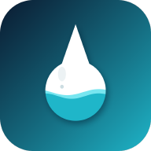
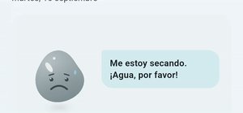
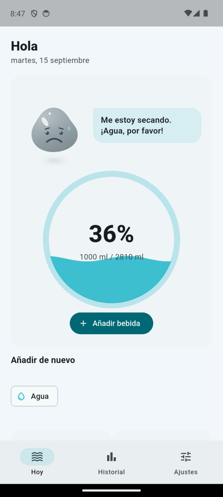
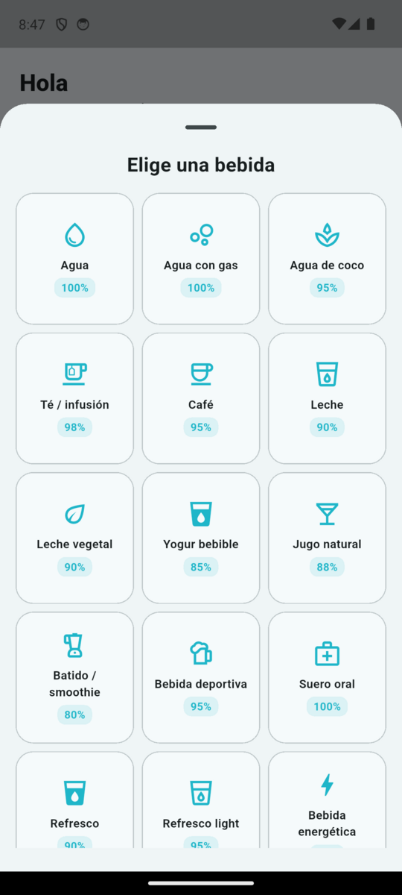
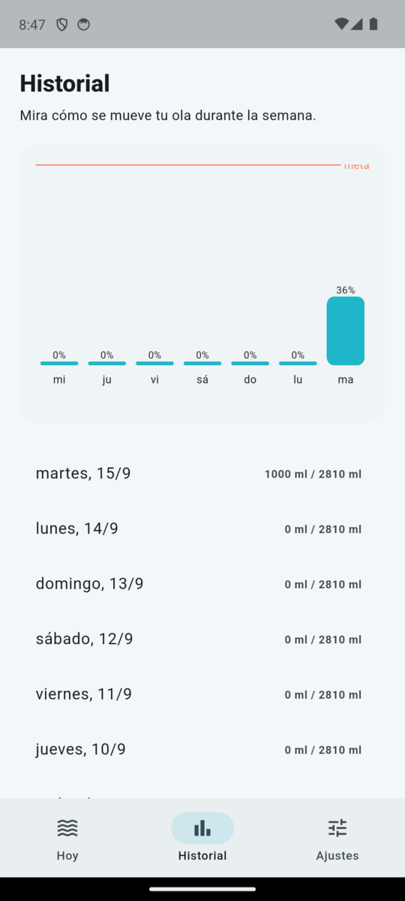
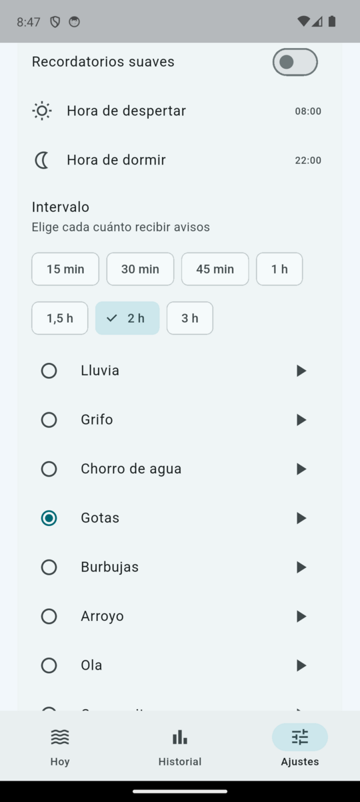
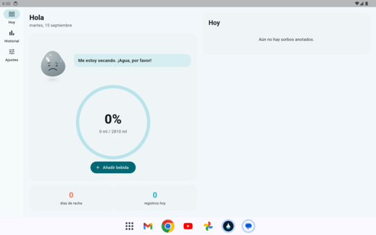
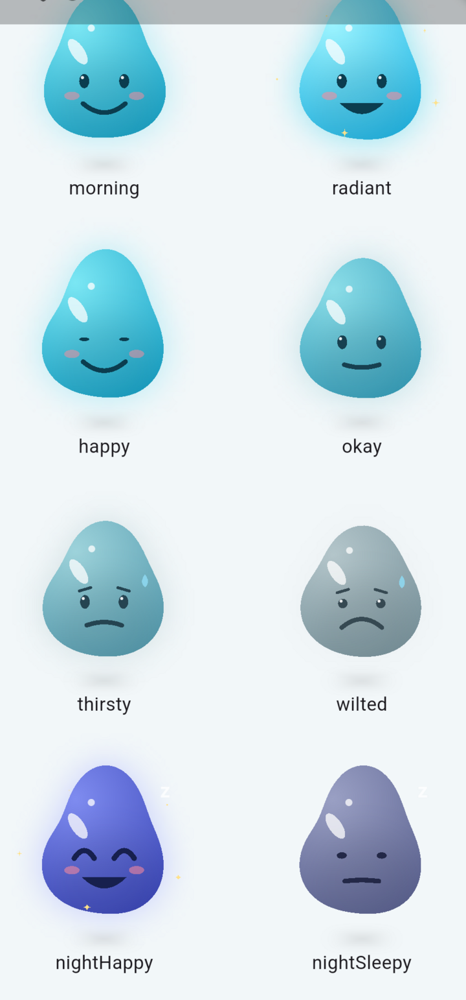

<div align="center">

# 💧 HydraFlow



**Registra tu hidratación con una meta hecha a tu medida, más de 20 bebidas, recordatorios con sonidos de agua y una gotita que vive según cómo va tu día.**

[](https://flutter.dev)
[](https://dart.dev)
[](#-instalación)
[](https://github.com/BOTOOM/HydraFlow/releases/latest)
[](#-privacidad)



</div>

---

## ✨ Funciones

| | |
|---|---|
| 🎯 **Meta personalizada** | Calculada a partir de sexo, edad, peso, actividad, clima, embarazo y lactancia siguiendo las recomendaciones de la EFSA (35 ml/kg hombre · 31 mujer · 33 otro, más ajustes). Puedes fijar una meta manual cuando quieras. |
| 🥤 **20+ bebidas con equivalencia** | No todo hidrata igual: agua 100 %, té 98 %, café 95 %, leche 90 %, jugo 88 %, refresco 90 %, cerveza 60 %, vino 30 %, licor 0 %… Coeficientes basados en el contenido de agua y el *Beverage Hydration Index*. Crea tus propias bebidas con su porcentaje. |
| 💧 **Gotita compañera** | Un avatar procedural (dibujado con `CustomPainter`, no un SVG estático) que respira, parpadea, celebra cada sorbo y se sacude al tocarlo. Su humor, color y forma cambian según lo cerca o lejos que estés de la meta a lo largo del día: feliz por la mañana, radiante al cumplir, sedienta o marchita si te atrasas, y súper feliz de noche si fuiste bien. |
| 🌊 **Hoy** | Medidor de anillo con ola animada, porcentaje y ml/oz, racha de días, registros del día (desliza para borrar) y accesos rápidos a tus bebidas recientes. |
| 📈 **Historial** | Gráfica de 7 / 30 días contra tu meta y detalle día a día. |
| 🔔 **Recordatorios** | Horario de despertar/dormir, intervalo de 15 min a 3 h, pausa automática al cumplir la meta y notificación de prueba. 30 mensajes distintos que rotan cada día. |
| 🎧 **Sonidos de agua** | Lluvia, grifo, chorro de agua, gotas, burbujas, arroyo y ola (además de campanita, marimba y un *splash* al registrar). Sintetizados con ruido filtrado por [`tool/gen_sounds.py`](tool/gen_sounds.py); con vista previa desde Ajustes. |
| 📱 **Responsive** | Barra inferior en teléfono; `NavigationRail` y dos columnas en tablet. Tema claro / oscuro, unidades ml / oz, icono adaptativo propio. |
| 🔒 **Privado** | Todo se guarda en el dispositivo (`sqflite` + `shared_preferences`). Sin cuenta, sin Internet, sin anuncios, sin telemetría. |

## 📸 Capturas

<p align="center">
  
  
  
  
</p>

<p align="center">
  
</p>

## 💧 Los humores de la gotita

<p align="center">
  
</p>

| Estado | Cuándo |
|---|---|
| ☀️ **Mañana** | Acabas de despertar y aún no has bebido: te saluda con ganas. |
| 😄 **Feliz** | Llevas el ritmo esperado para la hora que es. |
| 🙂 **Bien** | Te atrasaste un poco; un sorbito la anima. |
| 😟 **Sedienta** | Vas bastante por detrás: se apaga y aparece una gota de sudor. |
| 😩 **Marchita** | Avanzada la tarde y muy lejos de la meta: se pone gris y se deforma. |
| 🤩 **Radiante** | Meta cumplida: brilla y suelta estrellas. |
| 🌙 **Noche feliz** | Ya es hora de dormir y llegaste (o casi) a la meta. |
| 😴 **Noche somnolienta** | Se acabó el día y quedó agua pendiente… mañana será. |

El estado se calcula comparando tu progreso real con el esperado según la fracción del día transcurrida entre tu hora de despertar y de dormir. Beber sube el ánimo un escalón durante unos minutos, para que siempre notes el efecto de cada sorbo.

## 📦 Instalación

### Android (APK, sin tienda)

1. Descarga `hydraflow-vX.Y.Z.apk` desde el [último release](https://github.com/BOTOOM/HydraFlow/releases/latest).
2. Ábrelo en el teléfono y permite *Instalar apps desconocidas* para tu navegador o gestor de archivos.
3. Al terminar el onboarding acepta el permiso de notificaciones para recibir los recordatorios.

### iOS

No se publica `.ipa`: iOS no permite instalar apps fuera del App Store sin cuenta de desarrollador. Con un Mac con Xcode:

```sh
flutter build ipa --release        # o: flutter run -d <tu-iphone>
```

Los sonidos `.caf` ya están registrados en el proyecto de Xcode y `AppDelegate` configura las notificaciones locales.

## 🛠️ Desarrollo

```sh
flutter pub get
flutter run -d emulator-5554       # Android emulator
flutter analyze && flutter test    # lint + tests
flutter build apk --release
```

Regenerar los sonidos (numpy + ffmpeg) y el icono (Pillow):

```sh
python3 tool/gen_sounds.py         # → assets/sounds/*.ogg, android/.../raw/*.ogg, ios/Runner/*.caf
python3 tool/gen_icon.py
dart run flutter_launcher_icons
```

### Estructura

```
lib/
├── main.dart / app.dart          # arranque, providers, tema, shell responsive
├── domain/
│   ├── hydration_calculator.dart # fórmula de la meta diaria
│   ├── drink.dart                # catálogo de bebidas y coeficientes
│   ├── avatar_mood.dart          # humor de la gotita según hora y progreso
│   └── models.dart               # perfil, recordatorios, registros, preferencias
├── data/                         # sqflite (registros) y shared_preferences
├── services/                     # notificaciones locales y sonidos
├── state/controllers.dart        # controladores (provider)
└── ui/
    ├── screens/                  # onboarding, hoy, historial, ajustes
    └── widgets/                  # DropletAvatar, WaveGauge, DrinkTile, ProfileForm
assets/sounds/                    # OGG generados por tool/gen_sounds.py
tool/                             # generadores de sonidos e icono
```

Consulta [DESIGN.md](DESIGN.md) para el modelo de hidratación, la tabla completa de bebidas y las decisiones de diseño.

## 🔒 Privacidad

HydraFlow no pide cuenta ni conexión. Perfil, registros y preferencias viven únicamente en tu dispositivo; borrar la app borra los datos.

## 📄 Licencia

MIT — úsalo, modifícalo y, sobre todo, toma agua.
